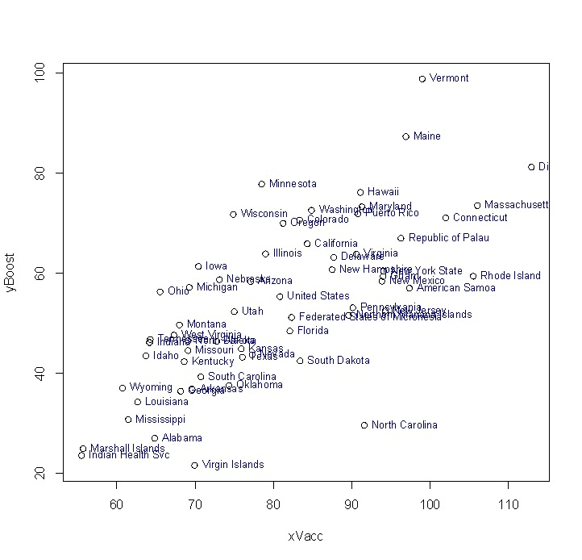

# Importing & Exporting Data in R

So far, we've created objects by assignment expressions that directly specify their values. Next, we'll learn how to **import** data into R. There are many ways to do this, but we'll just go over one main approach. 

After that, we'll talk about getting plots and tables **out** of R, also called **exporting**. 

These process are sometimes referred to as **IO**, for "Input and Output". 

First, let's download a dataset to import.

## Importing Data 

❗**EXERCISE** Download a data file

  * ➡️ Right click here:  [US_COVID_Vacc_by_StateTerr.csv](https://drive.google.com/file/d/1_0z0Bi3cg5GjWpz6FV23NMFw8V0kzQm_/view?usp=sharing)
  * ➡️ Download the file by clicking the down arrow in the top right set of icons.
  * ➡️ Save the file somewhere in your Documents directory/folder that makes sense. Consider adding it to a folder called "CM515". 
  * ➡️ Ensure the file name saved is "US_COVID_Vacc_by_StateTerr.csv" by viewing it in Finder or explorer.
  
❗ Take a little time here to ensure you know where the file is. 

### Importing Data - Setting the working directory

To import the file into R, we first need to sync up where R **thinks** it is working on your computer with the folder that contains a document you want to import. This is a bit tricky and will require some knowledge of **paths**.

**Paths** - a path describes the location of a folder or file on your computer. Because folders are nested on a computer, the path will start on the left with the "topmost" or "outer most" directory, and then progressively list different sub-directories. 

In R, folder names are separated by a "/" character.

To determine where R "thinks it is" on your computer, use the command `getwd()` for **get working directory**. **directory** is a more computer science-y term for "folder".

```r
getwd()
```

The output is listed as a path. Notice how the output to getwd() matches with the folder names at the bottom of the "Finder" window and with the different folder icons.


:heavy_exclamation_mark: MAC tip: If you don't see you path in the Finder, pull down the View menu and select Show Path Bar.

:heavy_exclamation_mark: PC tip: If you don't see your path in the Explorer, follow [these directions](https://pureinfotech.com/show-full-path-file-explorer-windows-10/)


## Setting the working directory

❗**EXERCISE** We need to set R's working directory to match the directory where our file lives.

  * ➡️ Go to the **Files** Panel of RStudio.
  * ➡️ Navigate to the location containing the downloaded dataset (may take some sleuthing)
  * ➡️ Change the working directory by going to the **Files Menu Banner**, selecting **More**, and selecting **Set As Working Directory**
  * ➡️ For posterity, copy and paste the command line that appears on the console that looks like `setwd(/directory/directory/)` into your .R script for next time

## Importing Data - Reading in the data

❗**EXERCISE** Together, let's write the code to read the data file into R.

We will use the command `read.table()` to import the dataset

```r

# Check we're in the right place
getwd() 

# Check how read.table is used
help(read.table)

# Look at the data using read.table
read.table("US_COVID_Vacc_by_StateTerr.csv", sep = ",", header = TRUE)

# Actually, I don't like those number row names
read.table("US_COVID_Vacc_by_StateTerr.csv", sep = ",", header = TRUE, row.names = "location")

# That only printed out the data from the file, it didn't capture it.
# To capture the data, use an assignment expression:
VaxByState <- read.table("US_COVID_Vacc_by_StateTerr.csv", sep = ",", header = TRUE, row.names = "location")

```


:+1: Use help(read.table) to learn how you can also use `read.csv` or `read.csv2` to upload comma separated content, also! There are many ways to do the same thing in R.

  * There are many ways to do the same task - this is going to be a theme. 


## Importing Data - EDA (Exploratory Data Analysis)

⚠️ **BEST PRACTICES** It is a wise idea to inspect your data once you have read it into R.

➡️ Look at what you have acquired and make sure everything looks good!

```r

dim(VaxByState)
str(VaxByState)
class(VaxByState)

```

## Obtaining, Cleaning, Wrangling, & Munging

I obtained the data from [Our World In Data](https://ourworldindata.org/). This is a great resource for worldwide statistics. I use this site because their data is **clean**. What do I mean by that?

  * headers don't contain spaces
  * no blank fields. Missing fields are labeled "NA"
  * no weird characters

One thing you will discover is that most datasets are NOT clean. It takes A LOT of ground work to make your data nice and neat and tidy. This ground work is called either **cleaning**, **wrangling**, or **munging** data, depending on your frustration level. 

I had to clean up this data quite a bit to make the neat and tidy file you just imported.
 
  * filtered for the most recent dates
  * removed superfluous columns
  * re-arranged the columns
  * removed data for US federal prisons, Defense Dept., and Veteran's hospitals because some of their data was missing.
  
## Review of importing data. 

Just to review, here are the basic steps of importing data...

  1. Obtain the data - download it, collect it, etc.
  2. Clean the data (I did this step for you)
  3. Set the working directory
  4. Use `read.table`, `read.csv` or some other function to import the data
  5. Exploratory Data Analysis (EDA)
  
----


# Exporting Data out of R

Next, I'll show you how to save data and plots we generate in R so they can be shared or published in reports, presentations, or publications.

  
⚠️ **BEST PRACTICES** Always include raw data tables as supplemental data when you publish a paper. Also, don't forget to acknowledge R, any packages, and note their versions in the materials & methods.


  * First, let's say we want to filter down this Vaccination data to just 3 columns: the "date"", the "people_fully_vaccinated_per_hundred", and "total_boosters_per_hundred" . So, this'll be a little summary. Next, let's export this data frame into a tab-delimited text file. 

  * Which columns are which?

➡️ Follow along:

```r

# Look at the column names
colnames(VaxByState)

# It looks like we want columns 1, 5, & 11

# Let's subset the data to create a new object called 
VaxByState_summary <- VaxByState[ , c(1,5,11)]

dim(VaxByState_summary)
head(VaxByState_summary)

# Now, let's explore the function write.table() 
help(write.table)

```

----


----


➡️ Let's export using `write.table()`

```r

write.table(VaxByState_summary, file = "Vaccinations_by_state_SUMMARY.txt", sep = "\t")

```

  * By default, R will export this table to your working directory.
  * Switch to your finder or explorer and open the file using a text editor
  * Yikes - I'm not loving those quotes. Let's return to the help page and see if we can change that...

```r

write.table(VaxByState_summary, file = "Vaccinations_by_state_SUMMARY.txt", quote = FALSE, sep = "\t")

```

  * HOORAY! The help page really helped. We were able to find an option that met our needs.
  
⚠️ **WARNING** If you open this in excel, the column names will be off-set so that "date" will be the column name for "state"

⚠️ **WARNING** Excel will automatically switch gene names to dates (ie: jun-1, oct-4). Use the **import** function in excel to specify the data type of each column to avoid this behavior.

  * **BONUS** - To export a vector object, use `write()` 

----

# Exporting Plots out of R

Now that we know how to export a data table, how would we export a plot?

Well, let's  make one first...

➡️ A simple plot

**X Y SCATTER PLOT** The function `plot()` uses the following syntax to plot x and y values into a scatter plot. It uses two vector objects as input: 


The result looks like this:


➡️ Let's try it! Say we want to see whether there is a relationship between the overall vaccination rates and the booster rates for different states. From first principles, we would predict that states with overall high vaccination rates also likely had high booster rates and vice versa. However, there may be interesting places where the initial rates of vaccination were high, but then the population did not boost at high levels. It would be interesting to find those states/territories.

```r
# We can use integer or numeric or integer classes as input
str(VaxByState)

# Use colnames to see the options for data we have available:
colnames(VaxByState)

# We'll use these x-values...
xVacc <- VaxByState$people_vaccinated_per_hundred

# ... and these y-values:
yBoost <- VaxByState$total_boosters_per_hundred

# Let's plot it!
plot(xVacc, yBoost)

# Let's add some labels
text(xVacc, yBoost, rownames(VaxByState),col='darkblue', pos = 4, cex = 0.8)
```




