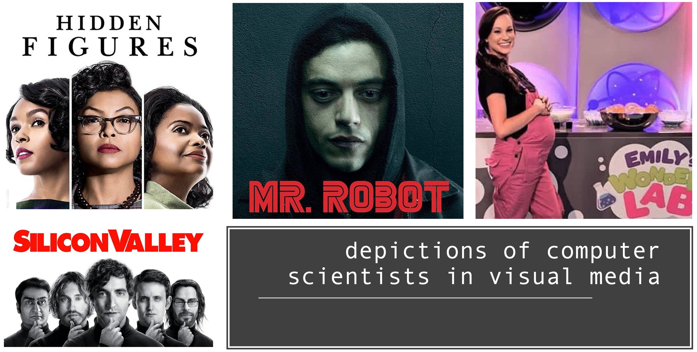

----

# R and RStudio

----

**Instructor:** Erin Osborne Nishimura, PhD

**Dates:** Monday February 3, 2025 & Wednesday February 5, 2025

## Introduction to Quantitative Cell and Molecular Biology! - R & R Studio Module

In this first module, we will explore the basics of **R**. What is R? 
  * R is a programming language, a coding environment, and a whole community. 
  * The goal of this module is __not__ to master R. That will take time. 
  * Here, we will just get to know a few basics of interfacing with and using R. 
  * Many people in this class are already familiar with R. There will be additional content for you. 

## Introductions

  * My background & my journey. How did I get here?
    * [Erin Osborne Nishimura website](https://onishlab.colostate.edu/home-page/erin-osborne-nishimura/)
    * You can call me "Erin", "Dr. Nishimura". (she/her)
    * Full disclaimer - I do not have a computer science background
  

## Learning objectives for this module

  1. Let's **start fresh** with coding
  2. Students will learn about R: it's **history** and how it is **useful in biological research**
  3. Students will learn how to **interface** with R and RStudio
  4. Students will become familiar with a few basic **R objects** (or extend their knowledge into new objects)
  5. Students will execute a few basic **R functions** (or extend their knowledge into new functions)
  
## Maybe in this module or next ones:
  * **Next:** Students will learn to **import and export** data
  * **Next:** Students will learn to extend functionality of R by loading **packages**
  * **Next:** Students will gain experience in basic **plotting**

-----

## 1. Let's **start fresh** with coding

*Who is a programmer? Who is a coder? Who is a computational biologist? Who is a bioinformatician? Who is a "geek"? What do these terms even mean?*

  * How have my past **experiences** in mathematics, coding, or quantitation shaped how I experience these fields? 
    * Do I **enjoy** these subjects?
    * Am I **good at** them?
    * Will I **fit in**?
  * What about the **stories** we absorb from visual and print media? How do these influence whether we feel like this is "our thing" or not?
  

  
Continue on to [R Basics](02_240129_R_Basics.md)

