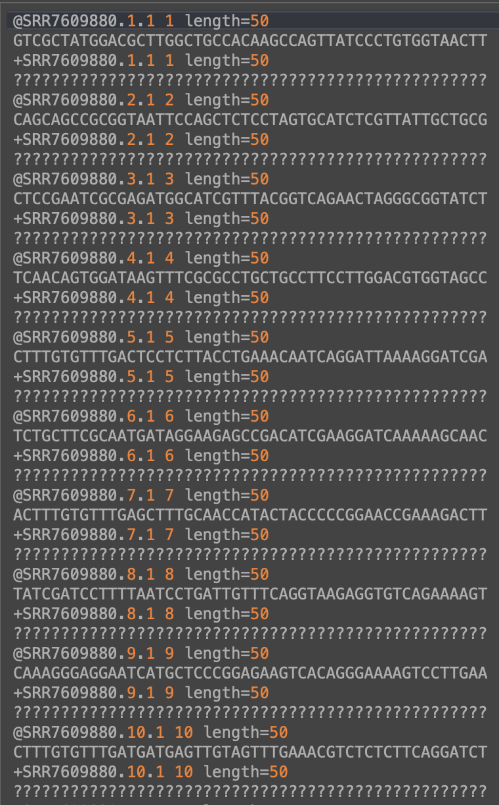

```{r setup, include=FALSE}
knitr::opts_chunk$set(echo = TRUE, error = TRUE, warning = FALSE)
```

---

## Databases

Quick survey: how many of you have worked with a biological database before? If so, which one(s)?

- This could be in the form of uploading or retrieving data from a database.

---

#### <ins> Biological Databases <ins>

As biological data accumulate at larger scales and increase at exponential paces, the number of biological databases (libraries or repositories) that have been developed to manage such data are growing at ever-faster rates. 

**Data can be in the form of:**

- nucleic acids (DNA and RNA) --> genomics assays
- proteins --> proteomics assays 
- small molecules --> metabolomics assays 

```{r echo=FALSE, out.width = "90%", fig.align = "center"}
knitr::include_graphics("./images/GrowthOfDNASequencing.png")
```

[Paper for the sfigure above](https://journals.plos.org/plosbiology/article?id=10.1371/journal.pbio.1002195)

A biological database is an organized collection of data, usually assembled using software particularly designed to organize, query, update and retrieve the data.

The primary objective of biological databases is not just to store, organize, and share data in a structured and searchable manner with the aim to facilitate data retrieval and visualization, but also to provide web application programming interfaces for computers to exchange and integrate data from various database resources in an automated manner.

**Databases are classified into 5 major categories:**

- Primary: stores raw information in the form of sequences and structures.

- Composite: combine various databases at a single platform; they contain a search algorithm. 

- Secondary: contain derived information from primary databases; derived information being information that is the outcome of the analysis of data from primary databases. 

- Structural: contain structural data, like 3D crystal structures obtained from NMR or X-ray crystallography. 

- Specialized: include several different types of specialized databases such as clustering databases, bibliographic databases, and expression databases. 

```{r echo=FALSE, out.width = "90%", fig.align = "center"}
knitr::include_graphics("./images/BiologicalDatabaseClassification.png")
```

[Paper for the figure above](https://www.sciencedirect.com/science/article/pii/B9780323897754000213)

---

#### <ins> Example Biological Databases <ins>

1. [Mouse Genome Informatics](http://www.informatics.jax.org/)
2. [Human Microbiome Project](https://hmpdacc.org/)
3. [UCSC Genome Browser](https://genome.ucsc.edu/)
4. [ATCC Genome Portal](https://genomes.atcc.org/?_ga=2.36707625.827873597.1643044790-1176553054.1640723221)
5. [Human Genome Resources at NCBI](https://www.ncbi.nlm.nih.gov/genome/guide/human/) 
6. [FlyBase](https://flybase.org/) 
7. [The Human Metabolome Database](https://hmdb.ca/)
8. [MicrobeNet](https://www.cdc.gov/microbenet/index.html)
9. [EnsemblBacteria](https://bacteria.ensembl.org/index.html)
10. [Microbial Genomes](https://www.ncbi.nlm.nih.gov/genome/microbes/)
11. [KEGG: Kyoto Encyclopedia of Genes and Genomes](https://www.genome.jp/kegg/)
12. [PubChem](https://pubchem.ncbi.nlm.nih.gov/)
13. [VIOLIN: Vaccine investigation and online information network](http://www.violinet.org/)
14. [SRA Database](https://www.ncbi.nlm.nih.gov/sra) 

---

#### <ins> How can we interact with databases? <ins>

**Retrieve available data**

- There is a paper you like and they deposited their data, making it publicly available. We can retrieve this data to analyze it. 

- You want to find all available data (maybe a particular type of data) on a specific topic or organisms. 

**Deposit generated data**

- You generated data (i.e., transcriptomic, metabolomic, etc.) in your research and now you want to make it publicly available to others!

These ideas stem in large part from the scientific communities desire and demand for data sharing, reproducibility, and having a plan to manage ones data!

See these links and resources for topics on:

- [General data management guidence](https://dmptool.org/general_guidance)
- [FAIR Principles](https://www.go-fair.org/fair-principles/)
- [FAIRsharing.org](https://fairsharing.org/)

You can also see 1) your future journal of interest for what they require regarding data sharing, and 2) NIH/NSF for what they require regarding a data management plan.

---

#### <ins> Example of retrieving data from a database <ins>

Lets use the following paper as an example: ["Inflammation-associated gut microbiome in postacute sequelae of SARS-CoV-2 points towards new therapeutic targets" by Valdirene Leao Carneiro et al. 2023](https://gut.bmj.com/content/early/2023/01/29/gutjnl-2022-328757.long)

```
We read with interest the recent report by Liu et al describing faecal microbiome differences with postacute sequelae of SARS-CoV-2 (PASC), commonly referred to as ‘Long-COVID’. We have previously reported elevated levels of SARS-CoV-2-specific T cells with PASC compared with resolved COVID-19 (RC; no lingering symptoms at the time of sample collection) that correlated with increased levels of the inflammatory marker IL-6, suggesting that elevated inflammation in PASC may be related to immune response to residual virus.2 Although several studies have reported gut microbiome differences during acute COVID-19,3 PASC has received less attention. We, thus, sought to characterise gut microbiome differences in PASC versus RC using faecal samples from our study2 and to relate these differences to inflammation.
```

Lets gather some data from this paper. To do this, we will visit [SRA](https://www.ncbi.nlm.nih.gov/sra/ERX9763720[accn]). 

The SRA (sequence read archive) houses sequencing data. You can search and download data from various published studies. 

Lets check out the [how to search and download](https://www.ncbi.nlm.nih.gov/sra/docs/sradownload/) section.

---

**Side exercise:** try downloading sequence data!

FASTA files and FASTQ files store sequence data and sequence metadata. 

* FASTA files have the following format: 
    + A header line starting with >, containing the sequence ID.
    + One or more lines that contain the sequence.

* FASTQ files have the following format: 
    + A header line starting with @, containing the sequence ID.
    + One or more lines that contain the sequence.
    + A new line starting with the character +, and being either empty or repeating the sequence ID.
    + One or more lines that contain the quality scores.

**see these resources for more information:**

- [FASTQ files](https://drive5.com/usearch/manual/fastq_files.html)
- [Quality (Phred) scores](https://drive5.com/usearch/manual/quality_score.html)

```{r echo=FALSE, out.width = "60%", fig.align = "center"}

```

Lets try reading in a FASTQ file from SRA
```{r}
#if (!require("BiocManager", quietly = TRUE))
#    install.packages("BiocManager")

#BiocManager::install("ShortRead")
library(ShortRead)

seq <- readFastq("./Example_Data/ERR10812839.fastq.gz", pattern=character(0))
sread(seq)
quality(seq)
id(seq)
```

---

**Now lets navigate to the papers data on SRA.**

We can use PRJEB56080 (bioproject ID) to search the particular project. 

Lets download the metadata that is available for this paper.
```{r}
data <- read.table('./Example_Data/SraRunTable.txt', sep=",", header = T)
```

Now lets interrogate
```{r}
head(data, 2)
```

```{r}
#install.packages("ggplot2")
library(ggplot2)

ggplot(data, aes(x = sex, y = IL.6)) +
  geom_boxplot() +
  geom_point(position = position_jitter(width = 0.2), size = 2) +
  labs(title = "Boxplot with Data Points", x = "Sex", y = "IL.6")
```

```{r}
ggplot(data, aes(x = sex, y = CRP)) +
  geom_boxplot() +
  geom_point(position = position_jitter(width = 0.2), size = 2) +
  labs(title = "Boxplot with Data Points", x = "Sex", y = "CRP")
```

```{r}
print(corr <- cor(x = data$IL.6, y = data$CRP, method = "pearson", use = "complete.obs"))
```

---

#### <ins> Additional Resources <ins>

[R for Data Science](https://r4ds.hadley.nz/data-visualize.html)

[R Graphics](https://r-graphics.org/)

[R Gallery](https://r-graph-gallery.com/)

**Regarding data submission to a database**

For transcriptomic data, often journals and funding agencies will require you to submit your data to [NIH's GEO](https://www.ncbi.nlm.nih.gov/gds/?term=). 

The Gene Expression Omnibus (GEO) is a public repository that archives and freely distributes microarray, next-generation sequencing, and other forms of high-throughput functional genomic data submitted by the scientific community. Accepts next generation sequence data that examine quantitative gene expression, gene regulation, epigenomics or other aspects of functional genomics using methods such as RNA-seq, miRNA-seq, ChIP-seq, RIP-seq, HiC-seq, methyl-seq, etc. GEO will process all components of your study, including the samples, project description, processed data files, and will submit the raw data files to the Sequence Read Archive (SRA) on the researchers behalf. In addition to data storage, a collection of web-based interfaces and applications are available to help users query and download the studies and gene expression patterns stored in GEO.