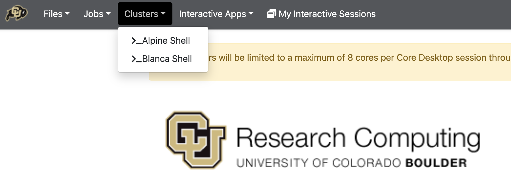
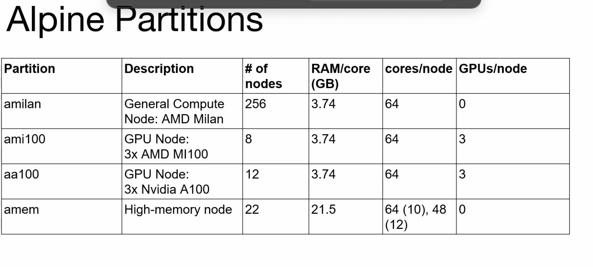
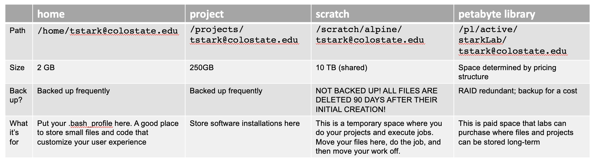

# Intro to ALPINE

Today, we will start to learn about **High-Performance Computing** or
HPC. HPC is a means of performing large computational tasks on
**supercomputers** or **compute clusters** in a way that takes advantage
of their ability to perform multiple tasks simultaneously.

**Supercomputers** in the crudest terms are basically what happens if
you glued 100\'s or 1000\'s of individual computers together. You end up
making a giant computer with more functionality.

The supercomputer we\'ll be using is **ALPINE** and it lives on CU
Boulder campus. ALPINE is a joint venture between Colorado State
University and CU Boulder and is sponsored by those institutes and by a
grant from the National Science Foundation. **ALPINE** is shared between
CU Boulder, Colorado State University, CU Anschutz, and RMACC (Rocky
Mountain Advanced Computing Consortium, a network of \>20 other academic
institutions in Colorado, Arizona, Idaho, Montana, and New Mexico).

There is a list of the [Top 500 biggest
supercomputers](https://www.top500.org/lists/top500/list/2023/06/) on
the planet (as of June 2023). According to this list, the largest
supercomputer is **FRONTIER** located at Oak Ridge National Labs in
Tennessee and run by the DOE (US Department of Energy).

How do these supercomputer systems compare to our laptops?


  |**Typical laptop**                 | **Alpine Supercomputer**  |  **FRONTIER Supercomputer**|
  |-----------------------------------|---------------------------|---------------------------|
  |0.1 - 10 teraFLOPS                 |450 teraFLOPS              |1,102,000 teraFLOPS        |
  |1 - 4 cores organized onto 1 node  |>15,500 cores on 458 nodes |8,730,112 cores |
  

-   FLOPS is a measure of how many floating point operations a computer
    can do per second. So it\'s a measure of calculations a second
-   Cores relates to how many CPUs (Central Processing Units) the
    computer has

:!: **NOTE:** *All* 500 of the top 500 Supercomputer systems run LINUX
or LINUX-based operating systems.

------------------------------------------------------------------------

### What are the benefits and drawbacks of using a supercomputer?

**Benefits**

-   power, efficiency, and speed!!!
-   team of professionals to help set up the system and provide user
    support
-   allows for collaboration with other users

**Drawbacks**

-   There is a learning curve
-   Multi-user platform requires job-sharing - there is usually a queue
    to execute your code
-   May not have architecture specialized for your task.

------------------------------------------------------------------------

## Resources & References

[Overview of Research Computing including
ALPINE](https://www.colorado.edu/rc/resources)

[ALPINE Quick Start
Guide](https://curc.readthedocs.io/en/latest/clusters/alpine/index.html)

[Please cite CURC Resources to help them maintain
funding!!!](https://curc.readthedocs.io/en/latest/index.html#acknowledging-rc)

[Expectations for user
behavior](https://www.colorado.edu/policies/acceptable-use-cu-boulders-it-resources)

[List of upcoming workshops](https://www.colorado.edu/rc/events)

[All content from past workshops](https://github.com/ResearchComputing/)

[FAQs](https://curc.readthedocs.io/en/latest/faq.html)


------------------------------------------------------------------------

## Accessing ALPINE

To log onto ALPINE, you can use the terminal command **ssh** or you can
use the browser portal called **onDemand**. I\'m including a description
of the **ssh** here for your reference, but we\'ll skip down to use
**onDemand** together.

------------------------------------------------------------------------

### Use onDemand to access ALPINE

The team at CU Boulder who developed ALPINE have helped to create an
alternative way to interact with the ALPINE Supercomputer, one that can
happen in you internet browser like Chrome or Firefox. This method of
accessing ALPINE is called OnDemand.

:!: **EXERCISE**: Let\'s connect to ALPINE using OnDemand:

-   Navigate to [](https://ondemand-rmacc.rc.colorado.edu) in a new tab
    or window
    -   For me, I right click on the above link and select **Open Link
        in New Window**
    -   You will be asked to select an identity provider using a
        pull-down menu. Select on the pull-down menu (it may say
        **ORCID**). Start typing **Colorado State University**. Click on
        **Remember** and log in. It should look like this


Next steps:

-   Log in using your CSU NET ID. You will receive a DUO PUSH on your
    phone. Accept it.
-   Go to **CLUSTERS** and select **\>\_Alpine Shell**



------------------------------------------------------------------------

### ssh into ALPINE

*description only. We will not demonstrate this.*

You can log into ALPINE using **ssh** in your own terminal window like
so:

``` bash
$ssh -l loki@colostate.edu login.rc.colorado.edu
Password: godofmischief,push
# Switch to your DUO app on your phone to approve

## OR ##
$ssh loki@colostate.edu@login.rc.colorado.edu
Password: godofmischief,push
# Switch to your DUO app on your phone to approve

```

:!: that\'s a lower case "L"

:!: no spaces around the `,`

:!: Replace loki@colostate.edu with your eID+e-mail

:!: Replace your password with godofmischief

:!: You won\'t see anything pop up when you type your password

:!: If `,push` doesn\'t work, try `,phone` or the 6-digit code on your
DUO app (refreshes every 20 seconds)

:!: If you are on a PC, they recommend using
[PuTTY](https://www.putty.org/) or
[Powershell](https://learn.microsoft.com/en-us/powershell/scripting/overview?view=powershell-7.3).
If you are on a MAC, just do this on your terminal.

------------------------------------------------------------------------

## The ALPINE System - Mapped out


Just like your local computer, the ALPINE supercomputer is comprised of
**computing hardware** (CPUs, GPUs, etc), memory, and **file storage
space**.

When we log into ALPINE through ssh or onDemand, we don\'t immediately
have access to all the parts of the ALPINE hardware. Instead, we arrive
at the login node. The name of the login node is written right prior to
the prompt. Typing `hostname` also gives you the name of the login node.

:!: **TRY IT**: Type `hostname`

### The Nodes

[Detailed descriptions of
nodes](https://curc.readthedocs.io/en/latest/compute/node-types.html)

Nodes are spaces on the SUMMIT system where you can do tasks and execute
jobs. Each node type has a designated purpose. Part of your job will be
to learn what is appropriate behavior on the different types of nodes.
We will learn about the **login nodes**, the **compile nodes**, and the
**compute nodes**.

### login nodes

When you first log into the SUMMIT system using `ssh`, you will be on a
**login node**. Think of this as a lobby of a hotel. This is where you
arrive first. You can do things like move and copy files, edit scripts,
and execute small tasks. You should not run large jobs in the login
node. You should not install software when you are here.

### compile nodes

To move to a compile node, use the command `acompile`.

:!: **TRY IT**: Switch over to a compile node like so\...

``` bash
$ hostname
$ acompile
$ hostname
```

When on a compile node, we can load existing software, install new
software, run small jobs, and send big jobs to the compute nodes.

Let\'s see what software is available to load:

:!: **TRY IT:**

``` bash
$ module avail
```

### compute nodes

**Compute notes** are the most numerous nodes on the system. There are
roughly 256 regular compute nodes on the ALPINE system and 42
specialized ones. The compute nodes are where big jobs will run.

To run the jobs, we will need to get in line by requesting a job through
a process called **batch submission**. Depending on how many users there
are and what types of jobs have already been requested to run, we will
be assigned to different compute nodes when they become available. The
batch submission software used by ALPINE is called **slurm** and the
main command we use is `sbatch`.

Compute nodes are **multi-core processors**. This means we can run
multiple jobs on one node. In the ALPINE architecture, we will mostly be
using the **AMD milan** compute nodes (called `amilan`) which have 64
cores and can run up to 64 jobs simultaneously. Users can also request
multiple nodes, too.

Here is an outline of the different types of compute nodes available:



------------------------------------------------------------------------

## ALPINE File Storage

-   [Detailed information about the File Storage on
    ALPINE](https://curc.readthedocs.io/en/latest/compute/filesystems.html)

Whereas the nodes are analogous to CPU and memory on your home laptop,
the filesystem is analogous to your hard drive. This is where data will
be stored. The ALPINE team has pre-organized several nice directories
where each user can house their data. Each space has a designated
purpose.

Here are the different file storage spaces available:



:!: **EXERCISE**:

Explore your directories through the command line on ALPINE:

``` bash
$ curc-quota. #curc-quota lets you check how much disk space you are using up 
$ pwd # check where you are
$ ls -alh
$ cd /projects/$USER
$ ls -alh
$ cd /scratch/alpine/$USER
$ ls -alh
```

[{width="40"
query="?40"}](/wiki/runningalpine)[Running Jobs on
ALPINE](/wiki/runningalpine)
